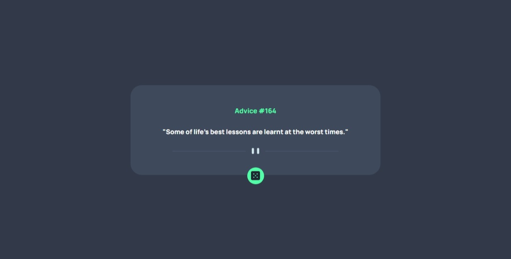

# Frontend Mentor - Advice generator app solution

This is a solution to the [Advice generator app challenge on Frontend Mentor](https://www.frontendmentor.io/challenges/advice-generator-app-QdUG-13db). Frontend Mentor challenges help you improve your coding skills by building realistic projects.

## Table of contents

- [Overview](#overview)
  - [The challenge](#the-challenge)
  - [Screenshot](#screenshot)
  - [Links](#links)
  - [Built with](#built-with)

**Note: Delete this note and update the table of contents based on what sections you keep.**

## Overview

### The challenge

Users should be able to:

- See random advice.

### Screenshot

### Links

- Live Site URL: [Advice Generator](https://advice-generator-eosin-nu.vercel.app/)
- Solution URL: [Repositories](https://github.com/PHnrq/advice-generator)

### Built with

- Semantic HTML5 markup
- CSS custom properties
- Flexbox
- TypeScript
- Mobile-first workflow
- [React](https://reactjs.org/) - JS library
- [Styled Components](https://styled-components.com/) - For styles
